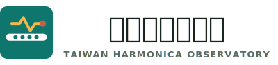

<p align="center">
  <picture>
    <source media="(prefers-color-scheme: dark)" srcset="site/assets/logo-github-dark.svg">
    <source media="(prefers-color-scheme: light)" srcset="site/assets/logo.svg">
    
  </picture>
</p>

# 臺灣口琴觀測站

`harmonica.observe.tw` 是一個獨立的臺灣口琴公開資訊索引站。它整理公開可查的口琴活動、社團、樂團、演奏者、教學單位、場館、補助與比賽資訊，並把整理後的資料輸出成靜態網站、JSON API 與 RSS。

這個 repository 是公開站本體，原則上只保存可以公開閱讀、公開查證的資料與產物。私人名單、內部註記、憑證、token、未公開群組連結、會員資料與其他不適合公開的資料都不應進入這個 repository。

## 目前輸出

- 網站首頁：`https://harmonica.observe.tw/`
- 資料索引：`https://harmonica.observe.tw/directory/`
- 資料回報：`https://harmonica.observe.tw/submit/`
- RSS 分類入口：`https://harmonica.observe.tw/feeds/`
- 公開 API：`https://harmonica.observe.tw/api/*.json`

首頁的「最新」河道由公開社群、YouTube、RSS/RSSHub 與整理後的候選更新資料產生；資料索引則由 `data/sources/` 下的公開 CSV 加上自動產生的標籤與更新狀態組成。

## 專案結構

```text
.
├── data/
│   ├── sources/                 # 人工維護的公開來源 CSV
│   └── feeds/                   # 社群來源設定、候選更新、抓取錯誤與快取
├── scripts/                     # 資料建置、社群抓取、RSS/API 產生工具
├── site/                        # 靜態網站根目錄
│   ├── api/                     # 產生出的公開 JSON API
│   ├── assets/                  # CSS、JS、logo、favicon、圖片快取
│   ├── data/                    # 前端讀取的 JS data bundle
│   ├── directory/               # 資料索引頁
│   ├── feeds/                   # RSS、分類頁與分類 JSON
│   └── submit/                  # 資料回報頁
├── state/                       # 本機執行狀態與分類快取
├── .github/ISSUE_TEMPLATE/      # 公開資料回報 issue form
└── README.md
```

重要檔案：

- `data/sources/harmonica-source-watchlist-public.csv`：公開來源主清單，包含演奏者、團體、教學、場館、活動平台等。
- `data/sources/harmonica-clubs-public.csv`：公開學生社團資料。
- `data/feeds/social_sources.json`：由 CSV 轉出的公開社群監看來源設定。
- `data/feeds/social_feed_inbox.jsonl`：YouTube / Facebook 抓取工具正規化後的公開貼文 inbox。
- `data/feeds/social_candidates.jsonl`：watchdog 篩選後的公開候選更新。
- `site/data/site-data.js`：前端資料索引使用的產生資料包。
- `site/api/*.json`：給外部工具或 Bamboo Hermes 讀取的公開 API。
- `site/feeds/*.xml` 與 `site/feeds/*.json`：公開 RSS 與對應 JSON。

## 資料怎麼蒐集與整理

觀測站以公開、可查證的資料為主。資料來源大致分成三類：

- 人工整理的公開來源清單：包含學校社團、演奏者、樂團、教學單位、場館、活動平台與公開社群入口。
- 公開社群與影音更新：包含 Facebook 公開頁面、Instagram、YouTube 頻道，以及透過 RSSHub 轉出的少量 X/Threads 公開來源。
- 公開活動與機會資訊：包含演出、講座、工作坊、成發、徵件、比賽、補助與報名資訊。

資料整理流程會先把公開來源統一成可查核的目錄項目，再把近期公開更新整理成首頁河道、分類 RSS 與 JSON API。社群更新會依照來源、平台、時間、關鍵字與語意標籤分類，讓同一批資料可以同時服務網站瀏覽、RSS 訂閱與外部工具讀取。

站上顯示的資訊不是完整名冊，也不是官方認證資料庫；它更接近一個公開訊號索引。若某個社團、演奏者或活動缺漏，通常代表目前還沒有被加入公開來源清單，或公開頁面尚未被監看到。

資料來源若有錯誤、失效或缺漏，可以從網站的資料回報頁補充公開連結。回報時最有幫助的是官方網站、公開社群頁、公開貼文、活動頁或其他能讓人確認資訊的公開來源。

## 公開 RSS

主要 RSS：

- `https://harmonica.observe.tw/feeds/updates.xml`：公開更新總河道。
- `https://harmonica.observe.tw/feeds/events.xml`：全臺口琴實體活動。
- `https://harmonica.observe.tw/feeds/posts-videos.xml`：口琴相關貼文與影片發布。
- `https://harmonica.observe.tw/feeds/student-clubs.xml`：口琴學生社團動態。
- `https://harmonica.observe.tw/feeds/opportunities.xml`：補助、徵件、甄選、比賽與報名資訊。
- `https://harmonica.observe.tw/feeds/sources.xml`：公開來源索引。

對應 JSON 也會產生在 `site/feeds/*.json`。

## 公開 API

外部工具與 Bamboo Hermes 應優先讀公開 JSON API，不要直接抓網站 HTML：

- `https://harmonica.observe.tw/api/latest.json`
- `https://harmonica.observe.tw/api/catalog.json`
- `https://harmonica.observe.tw/api/events.json`
- `https://harmonica.observe.tw/api/posts-videos.json`
- `https://harmonica.observe.tw/api/student-clubs.json`
- `https://harmonica.observe.tw/api/opportunities.json`
- `https://harmonica.observe.tw/api/sources.json`

若遠端用 `curl` 驗證 API 時遇到 403，可以加類瀏覽器 User-Agent：

```bash
curl -A 'Mozilla/5.0' https://harmonica.observe.tw/api/sources.json
```

## 資料回報

公開新增、修正、失效連結與來源更新應從網站回報頁開始：

```text
https://harmonica.observe.tw/submit/
```

回報頁會產生 GitHub Issue Form URL：

```text
https://github.com/skyhong2002/Harmonica-in-Taiwan/issues/new?template=content-correction.yml
```

Issue 會公開顯示。請只填公開可查資料，不要放私人電話、私人信箱、未公開群組連結、會員資料或憑證。

## License

MIT. See `LICENSE`.
